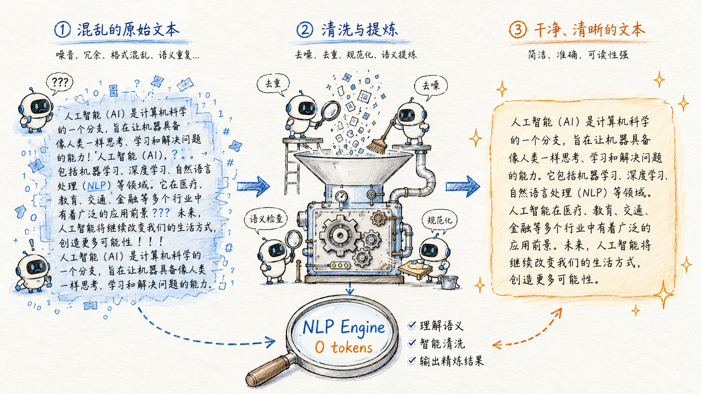
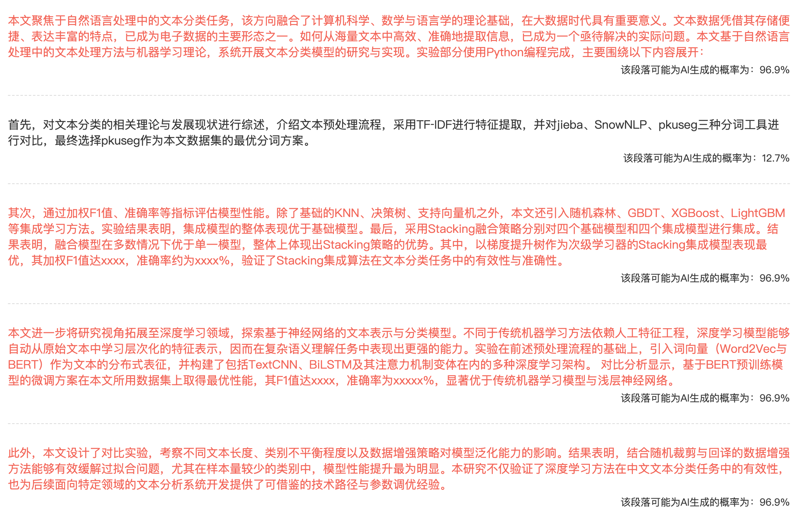
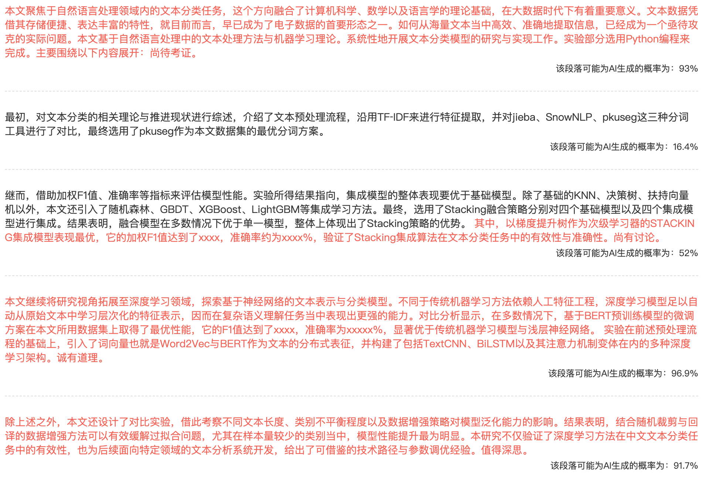
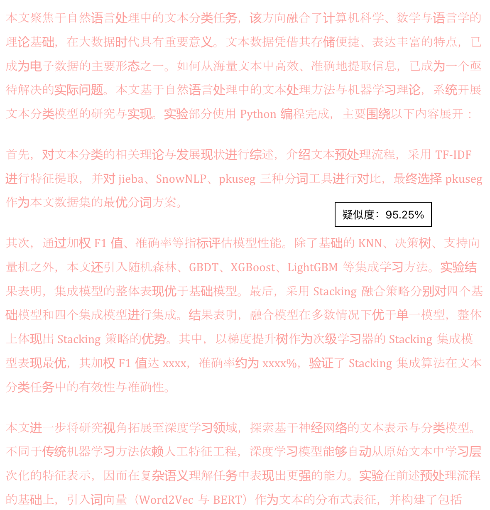
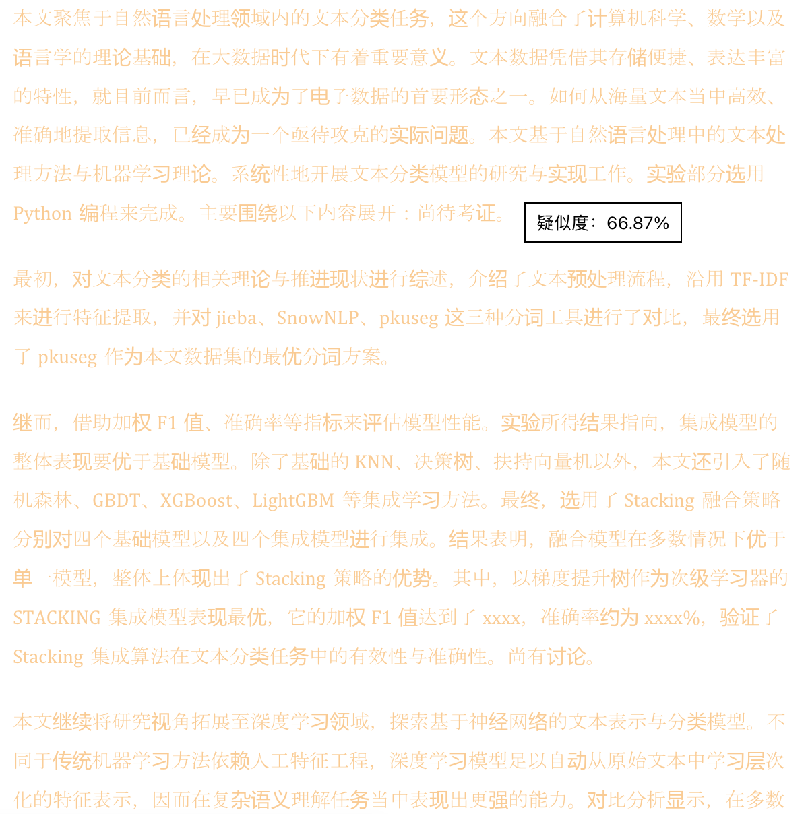
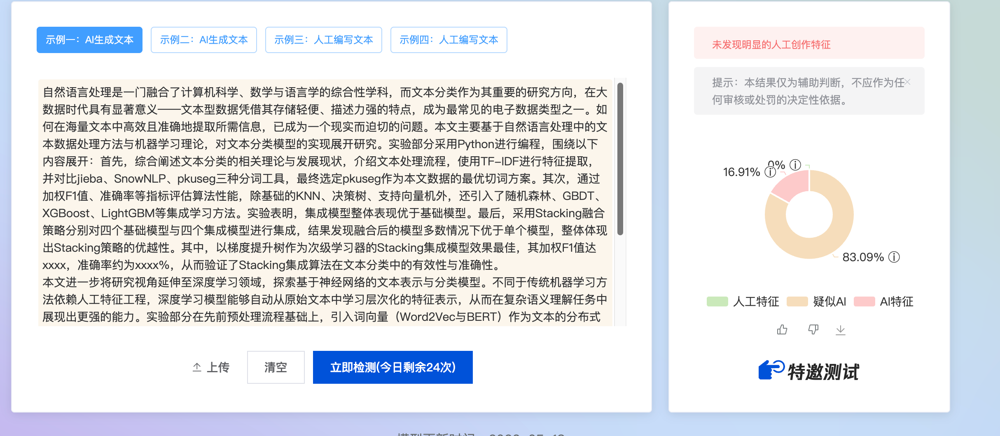
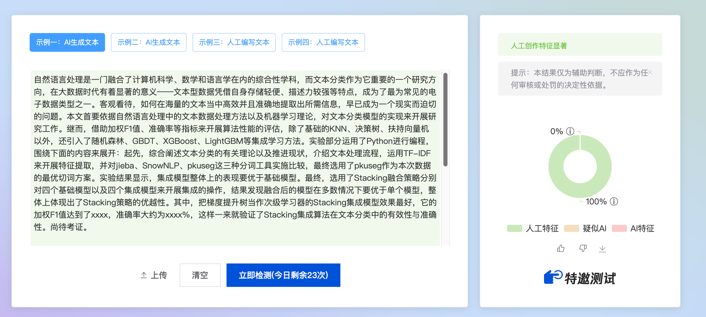
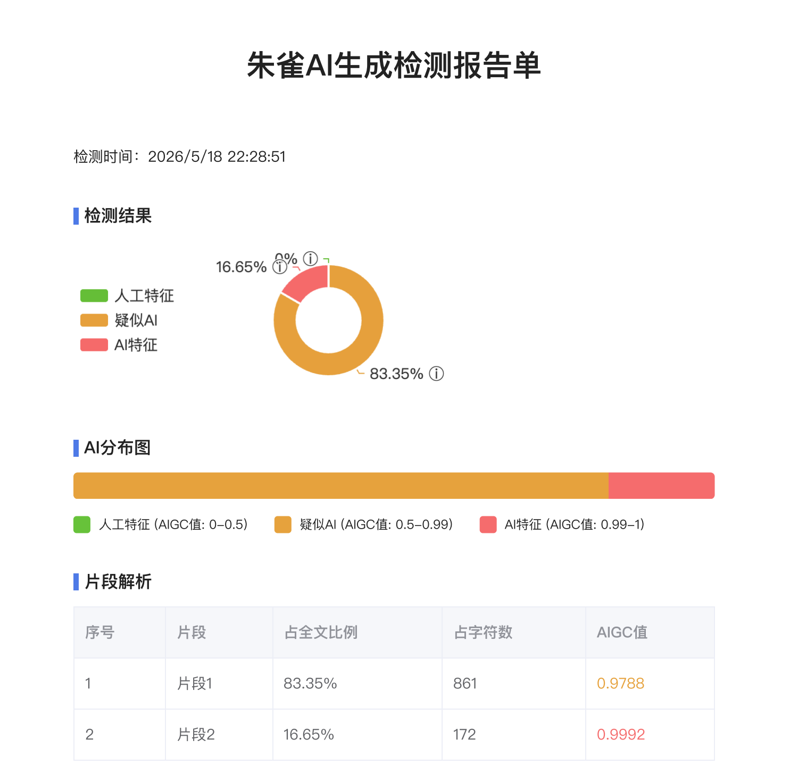
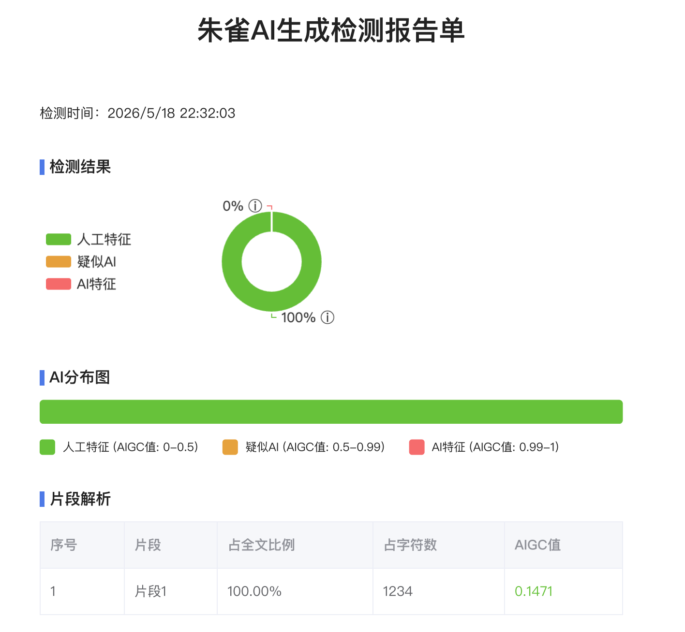
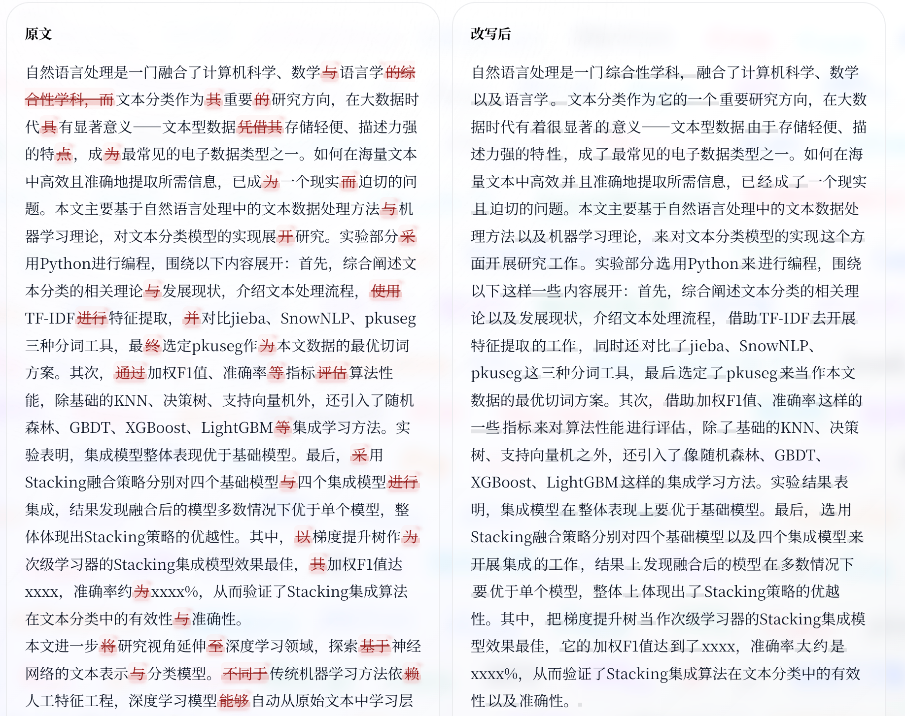

# **AI Cleaner：基于 NLP 的 AI 痕迹 Agent 系统**

*404: AI signature not found*



## **什么是 AI Cleaner？**

AI Cleaner 是一个基于 LangGraph 多 Agent 协作与本地 NLP 规则引擎的中文 AI 痕迹消解系统。通过 LLM 语义重构、Agent 迭代评估和零 token 本地后处理三层串联管线，在主流中文 AIGC 检测平台上均有稳定的低检出率表现。

> 本项目用于神经语言程序研究、Agent 工作流设计验证和人机协同实验。请勿将其用于学术不端、伪造原创或规避平台规则。
>
> 项目支持语言仅限于中文，非常不建议使用英文。作者对 Turnitin 检测算法仍在研究，欢迎对此有思路的朋友 Fork/PR。


### **核心能力**

- **低性能要求**：在独立 NLP 算法下，使用零 token 直接对文本进行改写；
- **多轮改写**：通过 LangGraph 状态机驱动改写 Agent 与评估 Agent 迭代协作，每轮由本地 AIGC 检测器产出风险报告，指导下一轮修订方向；
- **前端优雅**：支持流式输出、差异对比、历史记录和设置页调试
- **项目透明**：完整公开 LangGraph 工作流定义、Prompt 构造、NLP 管线、AIGC 检测逻辑及安全边界；
- **效果绝佳**：LLM 改写 + 本地 NLP 后处理双通道串联，前者负责语义重构与风格变换，后者以规则+统计方式做句式打散、节奏扰动和去模板化，实测在各大中文 AIGC 检测平台均有稳定降 AI 率表现。

### 实现效果

#### PaperYY、PaperPass 系

<table>
  <tr>
    <td></td>
    <td></td>
  </tr>
</table>

<table>
  <tr>
    <td></td>
    <td></td>
  </tr>
</table>

#### 腾讯朱雀大模型检测

<table>
  <tr>
    <td></td>
    <td></td>
  </tr>
</table>

<table>
  <tr>
    <td></td>
    <td></td>
  </tr>
</table>

#### 知网、维普、格子达 系

（待定，欢迎提交使用本工具的检测结果）

### **你可以用 AI Cleaner 做什么**

把一段中文文本丢进去，它会帮你改写成"**人看着觉得像 AI 写的，但是算法检测不出来**“的版本。

- 降低学术论文段落的 AI 痕迹；
- 消除 AIGC 文本的"总结腔"和"模板感"；
- 也许对初学者来说，是一个很棒的 LangGraph 案例，可以帮助你了解如何构建属于自己的 Agent 项目；




### **为什么 AI Cleaner 能实现降 AIGC 检测**

AI Cleaner 的每一层改写机制都根据主流检测器的判别维度进行优化，主流中文 AIGC 检测器（知x、维x、x方等）是在多个维度捕捉**机器写作的统计指纹**，其中核心判别维度如下：

| **检测维度** | **技术含义** | **典型阈值（HC3 校准）** |
| --- | --- | --- |
| **困惑度** (Perplexity) | 文本对语言模型"过于可预测"→ AI 特征 | 低于人类文本分布均值 |
| **句长变异系数** (Sentence Length CV) | AI 句子长度分布异常均匀 | Cohen's d = 1.22，最强单维信号 |
| **短句缺失率** | AI 几乎不写 10 字以内的短句 | 短句占比 < 8% 触发 |
| **过渡词密度** | "然而/此外/综上所述"等连接词过度使用 | > 8次/千字触发 |
| **字符熵** | 用字过于集中，缺乏多样性 | MATTR < 0.65 触发 |
| **局部曲率** (DetectGPT-lite) | 每处选词都选最高概率续接 | GLTR top-10 占比 > 21% 触发 |
| **突发度** (Burstiness) | 困惑度在全文过于均匀，缺少人类写作的起伏 | 困惑度变异系数过低触发 |
| **模板化结构** | "首先…其次…最后"、"一方面…另一方面"等 | 正则匹配直接命中 |
| **AI 高频词库** | "值得注意的是"、"赋能"、"底层逻辑"等 | 动态词库密度检测 |

简单同义词替换几乎无效。以知* AIGC 检测为例，检测深入到语义向量和写作模式层面：把"人工智能技术在医疗领域的应用日益广泛"改成"AI科技于医学范畴之运用愈发普遍"，AIGC 率仅从 75% 降到 72%，因为信息密度、逻辑结构、语义节奏在向量空间中几乎重合。因此，降 AIGC 必须在**统计特征**和**写作模式**两个层面同时出击。

### **第一层：用大模型先做整体改写，让文本不再像原来的 AI 表达**

第一轮改写主要由 LLM 完成，从**表达方式、句子结构和论证顺序**上重新组织文本。

项目里内置不同场景下的 Prompt 模板，用来引导模型改写时重点处理这些问题：

- 避免使用过于模板化的连接词，比如“首先、其次、综上所述”；
- 打破过于工整、对称的句式结构；
- 减少空泛的抽象名词和套话式总结；
- 调整原文的论证顺序，让文章的逻辑推进方式发生变化。

如，原文可能是“先讲 A，再推出 B，最后得到 C”，改写后可以变成“先说明 C 为什么重要，再回到 B 和 A 进行解释”，文本在语义结构上和原文拉开距离。

### **第二层：用 Agent 多轮检查和修改，处理高风险句子**

只改一遍（即直接用 Prompt 让不同模型重新写一遍）通常很难把上述所有问题都处理干净。 AI Cleaner 通过 LangGraph 组织多个 Agent 反复协作：

> **改写 → 本地检测 → 找出问题 → 给出修改建议 → 定向改写 → 再次检测**

Agent 会先用本地检测器分析当前文本，找出哪些地方仍然比较像 AI 写的，比如：

- 哪些句子的 Perplexity 异常、长度平均，缺少变化；
- 哪些过渡词使用密集；
- 哪些模板化句式没有清理干净。

此部分为局部重写，避免文本在多轮改写后仍然停留在同一种 AI 风格里。

### **第三层：用本地 NLP 规则做后处理**

这是 AI Cleaner 和其他项目最大的区别之一。

在 LLM 完成改写后，系统会通过本地 NLP 管线做进一步处理，**不调用大模型，也不消耗 token**。事实上，即使 LLM 已经改过一轮，文本里仍然可能保留某种“AI 味”。

### **第四层：人工处理**

本项目的初衷是应对当前误判率极高的 AIGC 检测工具，而非为学术抄袭提供便利。

需要指出的是，受算法能力所限，经过本工具处理的文本仍可能带有明显的 AI 痕迹，无法直接“骗过”人工审查。因此建议将本项目输出视为**半成品初稿**，在此基础上进行人工润色，方能得到既通过算法检测、也经得起人工审阅的自然文本。


## **部署**

准备工作：

```bash
git clone https://github.com/SmartisanNaive/AI-Cleaner
cd AI-Cleaner
```

#### **后端**

```bash
# 项目根目录下运行
# 安装 uv（Python 包管理器）
curl -LsSf https://astral.sh/uv/install.sh | sh

# 安装依赖
uv sync

# 启动后端服务
uv run uvicorn backend.app.main:app --host 127.0.0.1 --port 8000
```

#### **前端**

```bash
# 前端目录下运行
cd frontend

# 安装 pnpm（如果没有）
npm install -g pnpm

# 安装依赖
pnpm install

# 开发模式（带热更新 + API 代理）
pnpm dev
# 访问 http://localhost:5173

# 或者构建生产版本
pnpm build
# 构建产物在 frontend/dist/，可由 FastAPI 直接 serve
```

## ~~Cloud 分支说明~~（还有点 bug）

Cloud 版本只用于本项目演示部分的项目信息披露，保证演示的网页端不会收集相关敏感信息。Cloud 分支下，用户在浏览器中输入的 API key 不会被后端长期保存。后端目前只保留了无状态的接口（例如 `/api/settings/test`、`/api/rewrite` 和 `/api/nlp*`），API key 只会在用户发起请求时短暂进入后端内存，并被转发给所选择的上游服务。如果用户没有填写 API key，系统才会使用服务端配置的环境变量作为兜底。同时，后端已经对 `/api/*` 响应统一设置了 `Cache-Control: no-store`，并且会对日志中的 `api_key`、`authorization`、`base_url` 等敏感字段做脱敏处理，降低泄露风险。

前端默认“不记住 API key / 不记住历史”。只有当用户主动勾选相关选项，并点击“保存到浏览器”后，信息才会写入本地 `localStorage`。

但仍请注意以下几点：

- Cloud 分支用于云端演示版，后端只做临时转发，不保存用户的 API Key、Base URL、输入正文、输出结果或历史记录。此部分主要是为了让云端演示的项目透明，不建议个人部署，建议团队部署进行二次开发。
- 云端演示版中，设置和历史记录只保存在浏览器本地；服务端不再提供 /api/settings 与 /api/history* 持久化接口。
- 可通过 AI_CLEANER_ALLOWED_ORIGINS 配置允许访问的前端域名，多个域名用英文逗号分隔。

## TODO

- [ ] Cloud 演示版本上线；
- [ ] 集成 Turnitin 检测；
- [ ] 小说文本适配（针对小说重写 Prompt 增加和小说语料风格的 NLP 算法优化），感谢佬友 moshangmoyu、星空的光等提出的需求，之前做这个项目的时候确实没有考虑到；
- [ ] 排版优化（根据 [#1](https://github.com/SmartisanNaive/AI-Cleaner/issues/1) 反馈，优化 Diff 配色与背景对比度，提升可读性）；
- [ ] …………


## 致谢

本项目的诞生离不开开源社区和诸多开发者的启发与帮助，在此由衷感谢：

### 核心框架

- **[LangGraph](https://github.com/langchain-ai/langgraph)** — 项目核心的 Agent 编排框架，为多轮改写与评估的协作流程提供了基础。

### 前端视觉效果

- **[Pretext](https://github.com/chenglou/pretext)** — 首页粒子文字动画效果的基础库，提供了出色的文字视觉渲染能力。
- **[Pretext Wind Effect](https://github.com/khj68/pretext-example/tree/main/effects/wind)** — 前端背景风吹粒子效果的参考实现。
- **[Pretext Typewriter Effect](https://github.com/khj68/pretext-example/tree/main/effects/typewriter)** — 前端文字打字机动画效果的参考实现。

### NLP 算法与研究参考

- **[humanize-chinese](https://github.com/voidborne-d/humanize-chinese)** — 本地 NLP 强力模式的核心算法来源，为去 AI 痕迹的规则引擎提供了重要参考（不知道为啥 404 了）。
- **[Humanizer-zh](https://github.com/op7418/Humanizer-zh)** — 中文 AI 文本人性化处理的思路与方案，为项目早期的算法设计提供了方向。
- **[baibaiAIGC](https://github.com/poleHansen/baibaiAIGC)** — AIGC 检测规避方向的探索项目，在本地检测器的设计上给予了启发。

### 社区讨论与思路启发

- **[Linux.do 讨论帖](https://linux.do/t/topic/620470)** — 中文 AIGC 降低 Prompt。
- **[Linux.do 讨论帖](https://linux.do/t/topic/649382)** — 各类 Prompt 的降 AI 率社区测试，为多层串联管线的架构设计提供了有价值的思路。

---

> 如果你的项目或文章在本项目中有所引用但未列出，欢迎提 Issue 或 PR 补充，我会第一时间添加。
